# Olá, eu sou o Lucas Cancela! 👋

Desenvolvedor de Software Júnior focado em soluções escaláveis e sistemas críticos. Atualmente, trabalho na **Semantix** com foco em ecossistemas .NET e Java.

### 🛠 Tecnologias e Ferramentas
- **Linguagens:** C#, Java, Python, SQL (Oracle/PostgreSQL), JavaScript.
- **Frameworks:** .NET Core, Spring Boot, React, Node.js.
- **Cloud & DevOps:** Azure, AWS, Docker, Kubernetes, Terraform.
- **Mensageria:** RabbitMQ.

### 🚀 Projetos em Destaque
- **Vitalis:** Sistema de gestão Full Stack (Spring/React) com mensageria assíncrona e Cloud Azure.
- **Zero One CRM:** CRM com integração de IA (Google Gemini) para análise de dados de vendas.

### 📊 Estatísticas do GitHub

### 📫 Como me encontrar
- **LinkedIn:** [linkedin.com/in/lucas-s-cancela/](https://www.linkedin.com/in/lucas-s-cancela/)
- **Email:** cancelalucas@outlook.com
